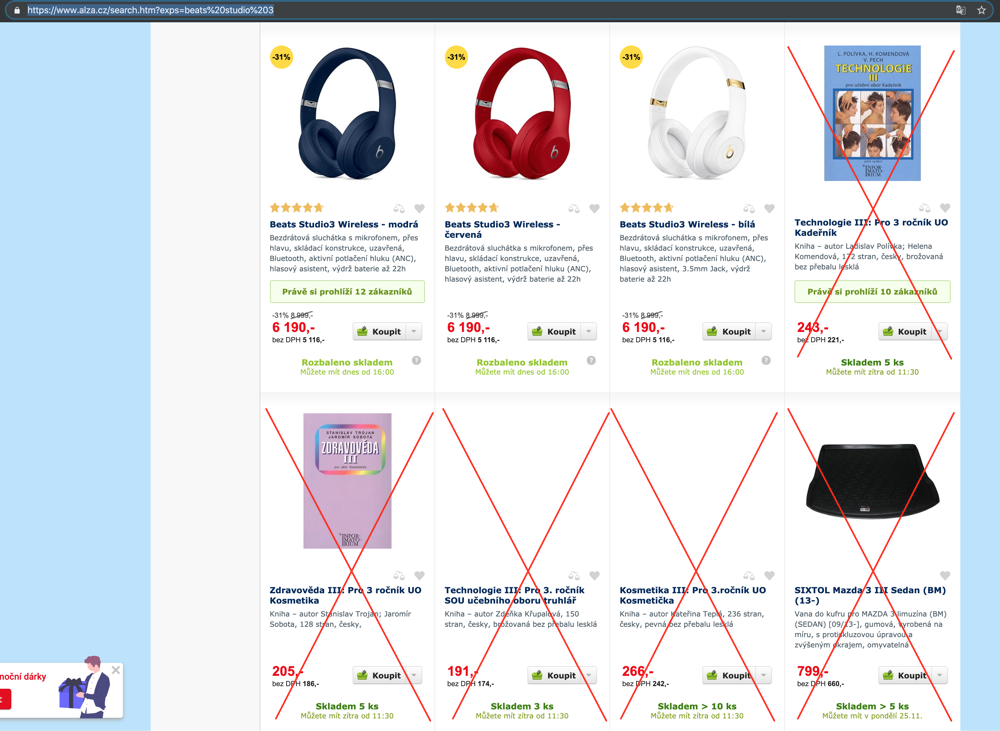

# Úkol 9: Web scraping

Vaším úkolem je vytvořit scraper produktů z e-shopů. Vyberte si alespoň dva e-shopy, pro které budete zjišťovat informace o produktech.
- Vstupem bude výraz např. `beats studio 3`, podle kterého necháte e-shopem vyhledat produkty.
- Pro každý produkt zjistěte: 
  - název,
  - cenu,
  - popis (může být na stránce s detailem) a
  - odkaz na produkt (detail)
- Pokuste se ze seznamu produktů odstranit irrelevantní položky

- Získané (relevantní) položky ze všech e-shopů zobrazte seřazené podle ceny vzestupně.

## Postup

- Použijte knihovnu [Goutte](https://packagist.org/packages/fabpot/goutte) nebo obdobnou.
- Vytvořte HTTP Request jehož výsledkem bude výsledek vyhledávání podle výrazu
- Iterujte přes jednotlivé produkty a pro každý získejte stránku s detailem
- Ze stránky s detailem extrahujte a uložte požadované údaje
- Z uložených údajů odstraňte irrelevantní produkty (např. podle názvu produktu nebo slov v popisu)
- Sestavte přehledný výpis ze získaných údajů seřazený podle ceny vzestupně 
