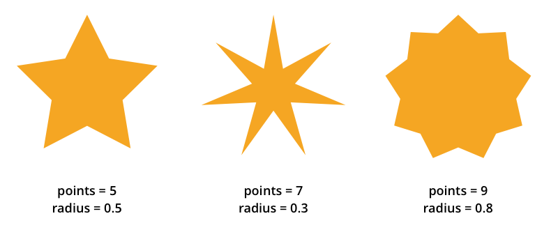

# Úkol 10

Vytvořte command line skript, který bude vykreslovat hvězdy podle zadaných parametrů.


```
$ ./star <width> <color> <points> <radius> <output>
```

**Povinné parametry**

- `width` - výška a šířka výsledného obrázku
- `color` - barva hvězdy
- `points` - počet cípů hvězdy
- `radius` - hodnota od 0 do 1, která definuje "vykousnutí" cípů (viz obrázek)
- `output` - název souboru, do kterého se obrázek uloží

**Nepovinné parametry**

- `bgColor` - barva pozadí, výchozí hodnota je bílá
- `borderColor` - barva rámečku, pokud není zadaná, rámeček se nevykreslí
- `borderWidth` - šířka rámečku v px, pokud není zadaná, rámeček se nevykreslí

**Poznámky**

- Výstup je ve formátu PNG, pokud název souboru, kam se má obrázek uložit končí `.png`, není potřeba ho měnit, v opačném případě je potřeba `.png` na konec přidat
- Barvy jsou zadané jako RGB int, pro převod můžete použít např. [RGB Int Calculator](https://www.shodor.org/stella2java/rgbint.html)
- Zajistěte, aby všechny parametry měly dokumentaci a zobrazily se v nápovědě (`./star --help`)
- Při vykreslování berte v potaz i šířku rámečku a přizpůsobte velikost hvězdy tak, aby se do zadané šířky a výšky vešla včetně rámečku
- Hvězdu do obrázku umístěte tak, aby její střed byl uprostřed obrázku a jeden cíp začínal vždy nahoře uprostřed (tzn. pro lichý počet cípů nebudou ostatní cípy až ke kraji obrázku)


